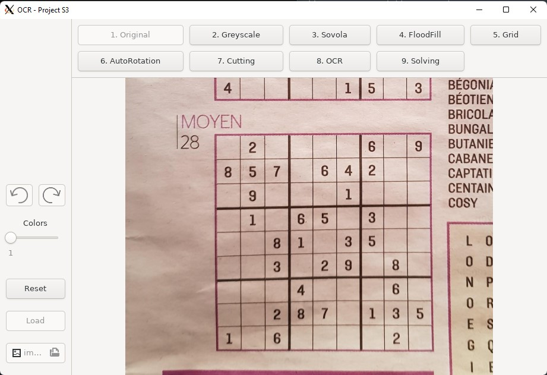
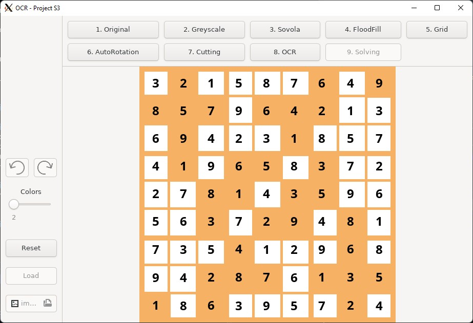

# OCR-Sudoku-Solver
OCR Sudoku Solver Projet S3 Epita. Here is a [link to our website](https://www.justwood-game.com/ocr.php).

## Installation
You need to have these installed :
 * libsdl2-dev
 * libsdl2-ttf-dev
 * libgtk-3-dev

To download our project :
```bash
wget https://github.com/ImperialCrise/OCR-SUDOKU-PROJECT/archive/refs/heads/main.zip \
-O "OCR-SUDOKU-PROJECT-main.zip" && \ 
unzip ./"OCR-SUDOKU-PROJECT-main.zip" && \
rm ./"OCR-SUDOKU-PROJECT-main.zip"
```
To compile our project :
```bash
make
```

## Usage
To run our project :
```bash
./ocr
```

## Clean project
To clean the project :
```bash
make clean
```


## FAQ :
 * I can't load an image, why ?
 Because you didn't open with admin rights or you need to create a folder named "tmp" in /datas/


## Credits :
 * [Emre Ulusoy](https://github.com/ImperialCrise)
 * [Guyno]()
 * [Youness]()
 * [DankaTeam](he)

## Nice pictures of the project



